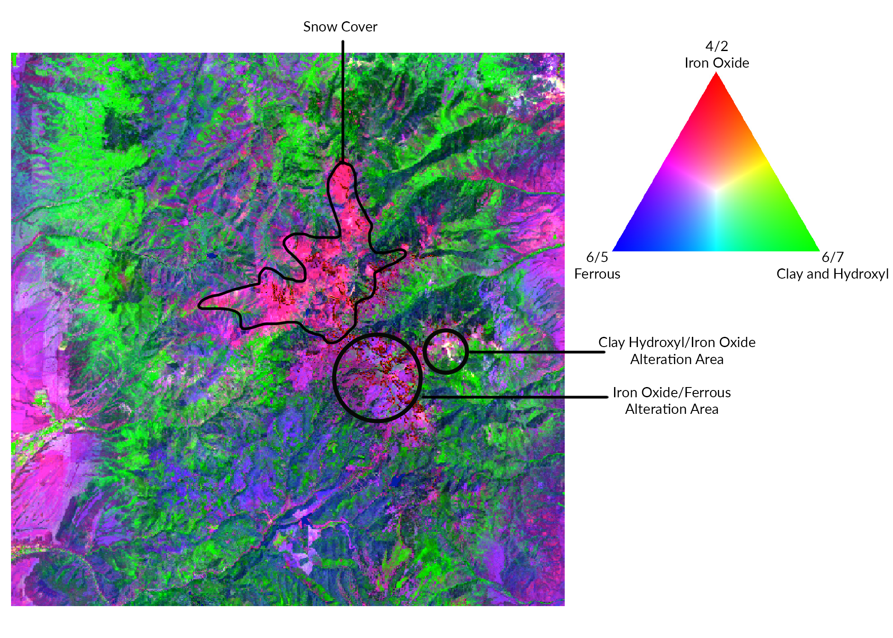

## **[Home](http://Noahjc26.github.io/index.html)** | **[About Me](http://Noahjc26.github.io/about_me/index.html)** | **[Final Project](http://Noahjc26.github.io/final_project/index.html)**

```{r setup, include=FALSE}
knitr::opts_chunk$set(echo = TRUE)
library(rmdformats)
```


### Geologic maps serve as a valuable tool in resource exploration.Traditional mapping is characterized by time-intensive and high-cost fieldwork, but through multispectral and hyperspectral remotely sensed images it is possible to map extensive areas instantly.

### Geologic background of Marysvale volcanics


```{r message=FALSE, warning=FALSE, include=FALSE}
library(raster)
library(terra)
library(tidyverse)
library(janitor)
library(plotly)
library(prismatic)
library(stringr)
library(tmap)
library(mapedit)
library(rpart)
library(rpart.plot)
library(rasterVis)
library(mapview)
library(caret)
library(forcats)
library(knitr)
library(kableExtra)
library(htmltools)
library(rasterVis)
library(viridis)
library(imager)
library(leaflet)
library(sf)
library(rgdal)
```


# **Background**

## Bandpass Filters

Bandpass filters are essential for collection and analysis of satellite imagery, they allow specific ranges of electromagnetic wavelengths, or *bands*, to be transmitted while blocking others. 

## FWHM

Full Width Half Mass (FWHM) is an important concept for understanding how different bands are delineated.

The graph below visualizes the idea of FWHM. Each band in a spectral device only takes in a specific range of wavelengths, often the wavelength for each band is just denoted as the peak, but in reality each sensor is collecting a range of wavelengths.
This is determined by denoting the FWHM as the area between the 50% transmittance on both sides of the curve.

```{r echo=FALSE}
knitr::include_graphics("../Media/visualizing_FWHM.png")
```


## Landsat 8, Hyperion, and ASTER bands 

In this plot you can see all the bands for Landsat 8, Hyperion, and ASTER. With their FWHM denoted as boxes. 
Its important to point out how Landsat 8 does have a band in the Short Wave Infrared (SWIR), but the FWHM is wide and this means that any SWIR data saved for this band could be attributed to any wavelength inside of the FWHM.

```{r echo=FALSE}
knitr::include_graphics("../Media/satellites_FWHM.png")
```


## Location of research

```{r echo=FALSE, message=FALSE, warning=FALSE}

# Set the center and zoom level for Utah
utah_location <- c(lat = 39.3200, lon = -111.8883)
zoom_level <- 6

# Set the UTM coordinates for Marysvale
marysvale_extent_utm <- list(easting_min = 360000, easting_max = 390000, northing_min = 4235000, northing_max = 4265000)

# Create an sf object with a Point geometry for UTM coordinates
marysvale_points_utm <- st_sfc(st_point(c(marysvale_extent_utm$easting_min, marysvale_extent_utm$northing_min)),
                               st_point(c(marysvale_extent_utm$easting_max, marysvale_extent_utm$northing_max))) %>%
  st_set_crs("+proj=utm +zone=12 +datum=WGS84")

# Transform UTM coordinates to latitude and longitude
marysvale_points_utm <- st_set_crs(marysvale_points_utm, "+proj=utm +zone=12 +datum=WGS84")
marysvale_points_lonlat <- st_transform(marysvale_points_utm, "+proj=longlat +datum=WGS84")

# Extract the transformed coordinates
marysvale_extent <- st_bbox(marysvale_points_lonlat)

# Create a leaflet map with HOT tile layer
utah_map <- leaflet() %>%
  setView(lng = utah_location["lon"], lat = utah_location["lat"], zoom = zoom_level) %>%
  addProviderTiles("OpenStreetMap.HOT") %>%
  addRectangles(
    lng1 = marysvale_extent[1], lat1 = marysvale_extent[2],
    lng2 = marysvale_extent[3], lat2 = marysvale_extent[4],
    fillColor = "transparent",
    color = "red",
    weight = 3
  )

# Show the map
utah_map

```

## Geologic Map

```{r echo=FALSE, message=FALSE, warning=FALSE}
cropped_beaver <- rast("../../Quads/beaver_quad/cropped_beaver.tif")

plotRGB(cropped_beaver, r = 1, g = 2, b = 3)
```


# **Landsat**

Landsat is an ongoing satellite imagery collection system with a recurrence interval of 8 days.
Now lets make some plots of different mineral groups:

## Iron Oxides

Iron Oxides mapping can be created using Band4/Band2

```{r echo=FALSE, message=FALSE, warning=FALSE}
#loading in imagery
cropped <- stack("../../landsat/LC09_L2SP_038033_20230715_20230717_02_T1/cropped.tif")

# 4/2 (iron-oxides), 6/7 (hydroxyl and clay minerals) and 6/5 (ferrous minerals) 
iron_oxides <- (cropped[[4]])/(cropped[[2]])
cropped[[8]] = iron_oxides

levelplot(cropped[[8]], 
          main = "Iron Oxides", stretch = "hist")
```

## Clay and Hydroxyl

Hydroxyl mineral mapping can be created using Band6/Band7

```{r echo=FALSE, message=FALSE, warning=FALSE}
#creating hydroxyl band
hydroxyl <- (cropped[[6]])/(cropped[[7]])
cropped[[9]] = hydroxyl

levelplot(cropped[[9]], 
          main = "Hydroxyl",stretch = "hist")
```

## Ferrous

Ferrous (iron minerals) can be mapped using Band6/Band5

```{r echo=FALSE, message=FALSE, warning=FALSE}
#creating ferrous band
ferrous <- (cropped[[6]])/(cropped[[5]])
cropped[[10]] = ferrous

levelplot(cropped[[10]], 
          main = "Ferrous", stretch = "hist")
```

## Sabins Ratio
A Sabins Ratio plot can be created by combining these three plots into an RGB profile.

Iron-oxide dominated areas are mapped in pink, clay and hydroxyl minerals in green and ferrous minerals are discriminated in blue. Hydrothermal alteration areas are represented by the association of green-pink or yellow zones.

```{r echo=FALSE, message=FALSE, warning=FALSE}

```


# **ASTER**
```{r echo=FALSE, message=FALSE, warning=FALSE}
aster <- rast("../../ASTER/2005_10_01/full_cleaned.tif")

#band 5/7
band11 <- (aster[[6]]/aster[[8]])

#band 5/4
band12 <- (aster[[6]]/aster[[1]])

#band 4/5
band13 <- (aster[[5]]/aster[[6]])

#b6/b8 * b9/b8 calcite index
band14 <- (aster[[7]]/aster[[9]])*(aster[[10]]/aster[[9]])

#(b7+b9)/b8 kaolinite, sericite, chlorite and epidoteminerals,
band15 <- (aster[[8]]+aster[[10]])/aster[[9]]

#adding all new ratios
aster2 <- c(aster,band11,band12,band13,band14,band15)

# off whitish cream color represents hydrothermal alteration

levelplot(aster2[[13]], 
          main = "Hydrothermal Alteration", stretch = "lin")

aster2[[13]][aster2[[13]] <= 1.6] <- 0


#calcite index


levelplot(aster2[[14]],
          main = "Calcite index", stretch = "lin")

aster2[[14]][aster2[[14]] <= 1.5] <- 0


#kaolinite, sericite, chlorite and epidoteminerals,
levelplot(aster2[[15]],
          main = "kaolinite, sericite, chlorite and epidote minerals", stretch = "lin")

aster2[[15]][aster2[[15]] <= 2.3] <- 0


```
Alteration zones

```{r echo=FALSE, message=FALSE, warning=FALSE}

#looking at alteration zones
plotRGB(aster2,r= 11,g= 12,b= 4,stretch="lin",main = "Alteration zones",axes=FALSE,margins=TRUE)

#adding a legend manually
legend("left", legend = c("red", "green", "blue"), fill = c("red","green","blue"))
```

