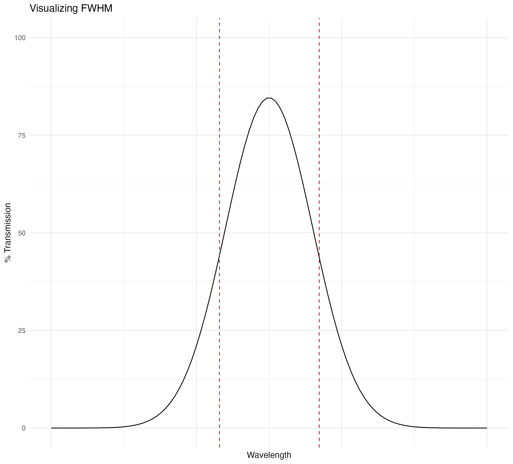
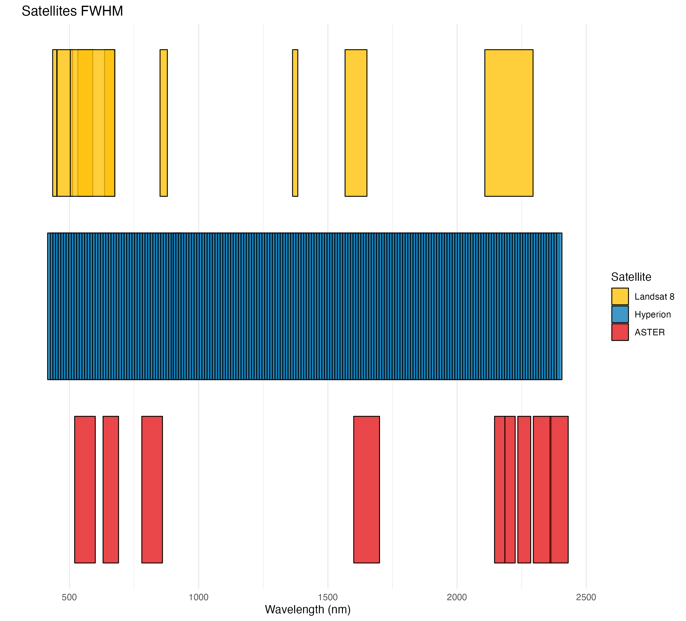

## **[Home](http://Noahjc26.github.io/index.html)** | **[About Me](http://Noahjc26.github.io/about_me/index.html)** | **[Final Project](http://Noahjc26.github.io/final_project/index.html)**

```{r setup, include=FALSE}
knitr::opts_chunk$set(echo = TRUE)
library(rmdformats)
```


### Geologic maps serve as a valuable tool in resource exploration.Traditional mapping is characterized by time-intensive and high-cost fieldwork, but through multispectral and hyperspectral remotely sensed images it is possible to map extensive areas instantly.

### Being able to calculate areas of interest for potential hydrothermal alteration zones can be extremely useful in determining the history and available resources geologically through remote sensing.

### add in Geologic background of Marysvale volcanics


```{r message=FALSE, warning=FALSE, include=FALSE}
library(raster)
library(terra)
library(tidyverse)
library(janitor)
library(plotly)
library(prismatic)
library(stringr)
library(tmap)
library(mapedit)
library(rpart)
library(rpart.plot)
library(rasterVis)
library(mapview)
library(caret)
library(forcats)
library(knitr)
library(kableExtra)
library(htmltools)
library(rasterVis)
library(viridis)
library(imager)
library(leaflet)
library(sf)
library(rgdal)
```


# **Background**

## Bandpass Filters

Bandpass filters are essential for collection and analysis of satellite imagery, they allow specific ranges of electromagnetic wavelengths, or **bands**, to be transmitted while blocking others. 

## FWHM

**Full Width Half Mass** (FWHM) is an important concept for understanding how different bands are delineated.

The graph below visualizes the idea of FWHM. Each band in a spectral device only takes in a specific range of wavelengths, often the wavelength for each band is just denoted as the peak, but in reality each sensor is collecting a range of wavelengths.
This is determined by denoting the FWHM as the area between the 50% transmittance on both sides of the curve.

```{r echo=FALSE}

```


## Landsat 8, Hyperion, and ASTER bands 

In this plot you can see all the bands for Landsat 8, Hyperion, and ASTER. With their FWHM denoted as boxes. 
Its important to point out how Landsat 8 does have a band in the Short Wave Infrared (SWIR), but the FWHM is wide and this means that any SWIR data saved for this band could be attributed to any wavelength inside of the FWHM.

```{r echo=FALSE}

```


## **Location of research**

```{r echo=FALSE, message=FALSE, warning=FALSE}

# Set the center and zoom level for Utah
utah_location <- c(lat = 39.3200, lon = -111.8883)
zoom_level <- 6

# Set the UTM coordinates for Marysvale
marysvale_extent_utm <- list(easting_min = 360000, easting_max = 390000, northing_min = 4235000, northing_max = 4265000)

# Create an sf object with a Point geometry for UTM coordinates
marysvale_points_utm <- st_sfc(st_point(c(marysvale_extent_utm$easting_min, marysvale_extent_utm$northing_min)),
                               st_point(c(marysvale_extent_utm$easting_max, marysvale_extent_utm$northing_max))) %>%
  st_set_crs("+proj=utm +zone=12 +datum=WGS84")

# Transform UTM coordinates to latitude and longitude
marysvale_points_utm <- st_set_crs(marysvale_points_utm, "+proj=utm +zone=12 +datum=WGS84")
marysvale_points_lonlat <- st_transform(marysvale_points_utm, "+proj=longlat +datum=WGS84")

# Extract the transformed coordinates
marysvale_extent <- st_bbox(marysvale_points_lonlat)

# Create a leaflet map with HOT tile layer
utah_map <- leaflet() %>%
  setView(lng = utah_location["lon"], lat = utah_location["lat"], zoom = zoom_level) %>%
  addProviderTiles("OpenStreetMap.HOT") %>%
  addRectangles(
    lng1 = marysvale_extent[1], lat1 = marysvale_extent[2],
    lng2 = marysvale_extent[3], lat2 = marysvale_extent[4],
    fillColor = "transparent",
    color = "red",
    weight = 3
  )

# Show the map
utah_map

```

## Geologic Map

```{r echo=FALSE, message=FALSE, warning=FALSE}
cropped_beaver <- rast("../../Quads/beaver_quad/cropped_beaver.tif")

plotRGB(cropped_beaver, r = 1, g = 2, b = 3)
```

# **Classification of Land Cover**

It is important to eliminate areas that are not exposed soil or rock to accurately map alteration zones.

Land cover classification over North America is available for download from the **[National Land Cover Database](https://www.mrlc.gov/data)**. 2021 classification was used as that is the most recent year available.

The Landsat imagery tested against the NLCD was collected Oct 19th, 2023.

NLCD has more specific delineations of landcover, I. combined this. and reduced the dimensions to three classifications: **Barren, Snow, and Vegetation**

```{r echo=FALSE, message=FALSE, warning=FALSE}
vegetation_df_long <- readRDS("../../Data_Course_CHRISTENSEN/Final_Project/vegetation_classification_landsat_LC09_L2SP_038033_20231019_20231020_02_T1.rds")

snow_df_long <- readRDS("../../Data_Course_CHRISTENSEN/Final_Project/snow_classification_landsat_LC09_L2SP_038033_20231019_20231020_02_T1.rds")

baren_df_long <- readRDS("../../Data_Course_CHRISTENSEN/Final_Project/baren_classification_landsat_LC09_L2SP_038033_20231019_20231020_02_T1.rds")

training_points <- readRDS("../../Data_Course_CHRISTENSEN/Final_Project/training_points_landsat_LC09_L2SP_038033_20231019_20231020_02_T1.rds")

#joining all of the dataframes together
part_df <- full_join(vegetation_df_long,snow_df_long)
full_df <- full_join(part_df,baren_df_long)

full_df <- full_df %>% 
  select(-ID)

#turning into data frame
df <- data.frame(training_points)

df <- df %>% 
  select(-ID)
#creating model based on column "class" 
model.class <- rpart(as.factor(class)~.,
                     data = df,
                     method = 'class',
                     control = rpart.control("minsplit" = 1))

#plotting the model as a tree
rpart.plot(model.class, box.palette = 4, main = "Classification Tree")
```


```{r echo=FALSE, message=FALSE, warning=FALSE}
# load in map and locality data
NLCD<-raster("../../Landcover/nlcd_2021_land_cover_l48_20230630/nlcd_2021_land_cover_l48_20230630.img")

# Define the UTM Zone 12 CRS
utm_crs <- CRS("+proj=utm +zone=12 +datum=WGS84 +units=m +no_defs")

# Define the extent in UTM Zone 12
utm_extent <- extent(360000, 390000, 4235000, 4265000)
utm_extent <- SpatialPolygons(list(Polygons(list(Polygon(cbind(c(utm_extent[1], utm_extent[2], utm_extent[2], utm_extent[1], utm_extent[1]), 
                                                               c(utm_extent[3], utm_extent[3], utm_extent[4], utm_extent[4], utm_extent[3])))), ID = "utm_extent")), proj4string = utm_crs)

# Transform the UTM extent to the current CRS of NLCD
utm_extent <- spTransform(utm_extent, crs(NLCD))

# Crop the raster using the transformed extent
NLCD_cropped <- crop(NLCD, utm_extent)

# Create a new raster with the same attributes as NLCD_cropped
reclassed_raster <- NLCD_cropped

# Set values below 24 to 1
reclassed_raster[values(reclassed_raster) < 20] <- 2

# Set values between 24 and 90 to 2
reclassed_raster[values(reclassed_raster) >= 20 & values(reclassed_raster) <= 40] <- 1

# Set values between 24 and 90 to 2
reclassed_raster[values(reclassed_raster) >50] <- 1

# Set values above 90 to 3
reclassed_raster[values(reclassed_raster) >= 40 & values(reclassed_raster) <= 50] <- 3

#reading in classified raster
ls <- raster("../../landsat/LC09_L2SP_038033_20231019_20231020_02_T1/classification.tif")

# Create a custom legend
legend_labels <- c("Barren", "Snow", "Vegetation")
legend_colors <- c("white", "yellow", "darkgreen")

# Plot the raster using levelplot
levelplot(ls, col.regions = legend_colors, at = c(0.5, 1.5, 2.5, 3.5),
          margin = FALSE, main = "Landsat Cart classification Land Cover",
          colorkey = list(labels = list(at = 1:3, labels = legend_labels)))

# Project ls to have the same extent and resolution as reclassed_raster, using method nearest neighbor"
ls_projected <- projectRaster(ls, reclassed_raster,method = "ngb")

# Assuming reclassed_raster and ls are your rasters
reference <- values(reclassed_raster)
predicted <- values(ls_projected)

# Assuming predicted and reference are your vectors
predicted <- as.factor(predicted)
reference <- as.factor(reference)

# Create a confusion matrix
conf_matrix <- confusionMatrix(predicted, reference)
```

**Class 1: Barren**
**Class 2: Snow**
**Class 3: Vegetation**

```{r echo=FALSE, message=FALSE, warning=FALSE}
# Print the confusion matrix
print(conf_matrix)

# Extract accuracy and other metrics
accuracy <- conf_matrix$overall["Accuracy"]
kappa <- conf_matrix$overall["Kappa"]

# Print accuracy and kappa
cat("Accuracy:", accuracy, "\n")
cat("Kappa:", kappa, "\n")
```

# **Landsat**

Landsat is an ongoing satellite imagery collection system with a recurrence interval of 8 days.

```{r}
plotRGB(cropped, r=4,g=3,b=2, main = "Original RGB",stretch="lin",axes=FALSE)
```

Now lets make some plots of different mineral groups:

## Iron Oxides

Iron Oxides mapping can be created using Band4/Band2

```{r echo=FALSE, message=FALSE, warning=FALSE}
#loading in imagery
cropped <- stack("../../landsat/LC09_L2SP_038033_20231019_20231020_02_T1/cropped_masked.tif")


# 4/2 (iron-oxides), 6/7 (hydroxyl and clay min- erals) and 6/5 (ferrous minerals) 
iron_oxides <- (cropped[[4]])/(cropped[[2]])
cropped[[8]] = iron_oxides

breaks <- c(1.35,2.5)

levelplot(cropped[[8]], 
          main = "Iron Oxides",
          colorkey=FALSE,
          col.regions =  "green",
          margin = FALSE,
          at = breaks)
```

## Clay and Hydroxyl

Hydroxyl mineral mapping can be created using Band6/Band7

```{r echo=FALSE, message=FALSE, warning=FALSE}
#creating hydroxyl band
hydroxyl <- (cropped[[6]])/(cropped[[7]])
cropped[[9]] = hydroxyl

# Set up breaks for the color scale
breaks <- c(1.28,2.5)

levelplot(cropped[[9]], 
          main = "Hydroxyl",
          colorkey=FALSE,
          col.regions =  "green",
          margin = FALSE,
          at = breaks)
```

## Ferrous

Ferrous (iron minerals) can be mapped using Band6/Band5

```{r echo=FALSE, message=FALSE, warning=FALSE}
#creating ferrous band
ferrous <- (cropped[[6]])/(cropped[[5]])
cropped[[10]] = ferrous

# Set up breaks for the color scale
breaks <- c(1.25,2.5)

levelplot(cropped[[10]],
          at = breaks,
          margin = FALSE,
          col.regions = "green",
          colorkey = FALSE,
          main = "Ferrous")
```

## Sabins Ratio
A Sabins Ratio plot can be created by combining these three plots into an RGB profile.

Iron-oxide dominated areas are mapped in pink, clay and hydroxyl minerals in green and ferrous minerals are discriminated in blue. Hydrothermal alteration areas are represented by the association of green-pink or yellow zones.

```{r echo=FALSE, message=FALSE, warning=FALSE}
# alteration zones,with iron-oxide, clay-hydroxyl and ferrous minerals dominated areas respectively in pink, green and blue. 
plotRGB(cropped, r = 8, g = 9, b = 10, axes = FALSE, 
        stretch = "lin", main = "Sabins Ratio")

knitr::include_graphics("../Media/annotated_sabins_landsat8.png",dpi=263.25)
```

# **ASTER**

```{r echo=FALSE, message=FALSE, warning=FALSE}
aster <- rast("../../ASTER/2005_10_01/full_cleaned.tif")

#band 5/7
band11 <- (aster[[6]]/aster[[8]])

#band 5/4
band12 <- (aster[[6]]/aster[[1]])

#band 4/5
band13 <- (aster[[5]]/aster[[6]])

#b6/b8 * b9/b8 calcite index
band14 <- (aster[[7]]/aster[[9]])*(aster[[10]]/aster[[9]])

#(b7+b9)/b8 kaolinite, sericite, chlorite and epidoteminerals,
band15 <- (aster[[8]]+aster[[10]])/aster[[9]]

#adding all new ratios
aster2 <- c(aster,band11,band12,band13,band14,band15)

```


```{r eval=FALSE, message=FALSE, warning=FALSE, include=FALSE}
levelplot(aster2[[13]], 
          main = "Hydrothermal Alteration", stretch = "lin")

aster2[[13]][aster2[[13]] <= 1.6] <- 0

```

## Calcite Index

Calcite minerals can be mapped using (b6/b8) * (b9/b8)

```{r echo=FALSE, message=FALSE, warning=FALSE}
levelplot(aster2[[14]],
          main = "Calcite index", stretch = "lin")

aster2[[14]][aster2[[14]] <= 1.5] <- 0
```

## Kaolinite, sericite, chlorite, and epidote index

Kaolinite, sericite, chlorite, and epidote minerals can be mapped using (b7+b9)/b8

```{r echo=FALSE, message=FALSE, warning=FALSE}
#kaolinite, sericite, chlorite and epidoteminerals,
levelplot(aster2[[15]],
          main = "kaolinite, sericite, chlorite and epidote minerals", stretch = "lin")

aster2[[15]][aster2[[15]] <= 2.3] <- 0

```

## Alteration zones

```{r echo=FALSE, message=FALSE, warning=FALSE}
#looking at alteration zones
plotRGB(aster2, r = 11, g = 12, b = 4, stretch = "lin", main = "Alteration zones", axes = FALSE)
```

