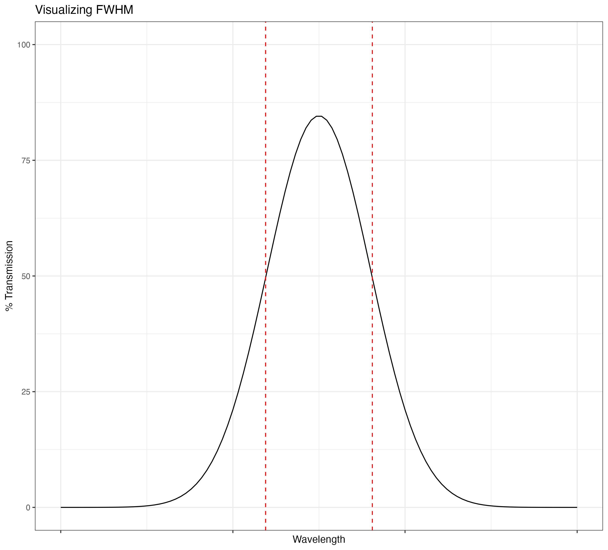

## **[Home](http://Noahjc26.github.io/index.html)** | **[About Me](http://Noahjc26.github.io/about_me/index.html)** | **[Final Project](http://Noahjc26.github.io/final_project/index.html)**

```{r setup, include=FALSE}
knitr::opts_chunk$set(echo = TRUE)
library(rmdformats)
```


Geologic maps serve as a valuable tool in resource exploration.
Traditional mapping is characterized by time-intensive and high-cost fieldwork, but through multispectral and hyperspectral remotely sensed images it is possible to map extensive areas instantly.


```{r message=FALSE, warning=FALSE, include=FALSE}
library(raster)
library(terra)
library(tidyverse)
library(janitor)
library(plotly)
library(cowplot)
library(prismatic)
library(stringr)
library(tmap)
library(mapedit)
library(rpart)
library(rpart.plot)
library(rasterVis)
library(mapview)
library(caret)
library(forcats)
library(knitr)
library(kableExtra)
library(htmltools)
```


# **Background**

## FWHM
Full Width Half Mass (FWHM) is an important concept for understanding how different band values are calculated.

Bandpass filters are used to isolate specific wavelengths.
The graph below visualizes the idea of FWHM. Each band in a spectral device only takes in a specific range of wavelengths, often the wavelength for each band is just denoted as the peak, but in reality each sensor is collecting a range of wavelengths.
This is determined by denoting the FWHM as the area between the 50% transmittance on either side of the curve.

```{r echo=FALSE}

```


In this plot you can see all the bands for Landsat 8, Hyperion, and ASTER. With their FWHM denoted as boxes. 
Its important to point out how Landsat 8 does have a band in the Short Wave Infrared (SWIR), but the FWHM is wide and this means that any SWIR data saved for this band could be attributed to any wavelength inside of the FWHM.

```{r echo=FALSE}
knitr::include_graphics("../Media/satellites_FWHM.png")
```

# **Landsat**

Loading in and cropping the imagery:

```{r echo=FALSE, message=FALSE, warning=FALSE}
library(rasterVis)
library(raster)
library(tidyverse)
library(viridis)
library(gridExtra)
library(shiny)
library(shinyjs)
library(imager)


band1 <- raster("../../landsat/LC09_L2SP_038033_20230715_20230717_02_T1/LC09_L2SP_038033_20230715_20230717_02_T1_SR_B1.TIF")
band2 <- raster("../../landsat/LC09_L2SP_038033_20230715_20230717_02_T1/LC09_L2SP_038033_20230715_20230717_02_T1_SR_B2.TIF")
band3 <- raster("../../landsat/LC09_L2SP_038033_20230715_20230717_02_T1/LC09_L2SP_038033_20230715_20230717_02_T1_SR_B3.TIF")
band4 <- raster("../../landsat/LC09_L2SP_038033_20230715_20230717_02_T1/LC09_L2SP_038033_20230715_20230717_02_T1_SR_B4.TIF")
band5 <- raster("../../landsat/LC09_L2SP_038033_20230715_20230717_02_T1/LC09_L2SP_038033_20230715_20230717_02_T1_SR_B5.TIF")
band6 <- raster("../../landsat/LC09_L2SP_038033_20230715_20230717_02_T1/LC09_L2SP_038033_20230715_20230717_02_T1_SR_B6.TIF")
band7 <- raster("../../landsat/LC09_L2SP_038033_20230715_20230717_02_T1/LC09_L2SP_038033_20230715_20230717_02_T1_SR_B7.TIF")


# Read Landsat imagery stack
landsat_stack <- stack(band1,band2,band3,band4,band5,band6,band7)

#setting extent
e <- as(extent(360000, 390000, 4235000, 4265000),'SpatialPolygons')

#cropping
cropped <- crop(landsat_stack,e)

plotRGB(cropped, r=4,g=3,b=2, main = "Original RGB",stretch="lin")
```


Now lets make some plots of different mineral groups:

```{r echo=FALSE, message=FALSE, warning=FALSE}
# 4/2 (iron-oxides), 6/7 (hydroxyl and clay min- erals) and 6/5 (ferrous minerals) 
iron_oxides <- (cropped[[4]])/(cropped[[2]])
cropped[[8]] = iron_oxides

levelplot(cropped[[8]], 
          col.regions = viridis(200),
          main = "Iron Oxides")

#creating hydroxyl band
hydroxyl <- (cropped[[6]])/(cropped[[7]])
cropped[[9]] = hydroxyl

levelplot(cropped[[9]], 
          col.regions = viridis(200),
          main = "Hydroxyl")

#creating ferrous band
ferrous <- (cropped[[6]])/(cropped[[5]])
cropped[[10]] = ferrous

levelplot(cropped[[10]], 
          col.regions = viridis(200),
          main = "Ferrous")
```


A Sabins Ratio plot can be created by combining these three plots into an RGB profile.
This leaves colors show a few different things
-
-

```{r}
plotRGB(cropped, r = 8, g = 9, b = 10, axes = FALSE, 
        stretch = "lin", main = "Sabins Ratio", margins=TRUE)


#adding a legend manually
legend("left", legend = c("Iron-oxide", "clay-hydroxyl", "ferrous"), fill = c("red","green","blue"))
```


# **HYPERION**


Hyperion data was downloaded from the **[USGS EARTH EXPLORER](https://earthexplorer.usgs.gov/)** as an *L1T Product in GeoTiff format*

Reading in L1T product

```{r,eval=FALSE}
l <- list.files(path="../../Hyperion/sevier_lake/EO1H0380332014325110PZ_1T/",
                pattern='TIF$',
                full.names=TRUE)
```


Rasterizing only working bands with the terra package

```{r,eval=FALSE}
r <- rast(l[c(8:57,77:224)])
```

## Hyperion Information
**[HYPERION BAND INFORMATION](https://developers.google.com/earth-engine/datasets/catalog/EO1_HYPERION#bands)**

```{r echo=FALSE, message=FALSE, warning=FALSE}
Hyperion_Bands <- readRDS("../../Data_Course_CHRISTENSEN/Final_Project/hyperion_band_info.rds")

# Display the DataFrame using kable with styling for a scrollable box
kbl(Hyperion_Bands) %>%
  kable_paper() %>%
  scroll_box(height = "400px")
```

## Correcting Imagery
When downloading Hyperion imagery it is stored with DN values.
Using information from the metadata you can correct this to surface reflectance.

```{r,eval=FALSE}
md <- read_lines("../../Hyperion/sevier_lake/EO1H0380332014325110PZ_1T/EO1H0380332014325110PZ_MTL_L1T.TXT")

julian_day <- as.numeric(word(md[18], 8))     #julian day
d <- (1-0.01672*cos(0.9865*(julian_day-4)))   #earth sun distance in astronomical distance
sun_elevation <- as.numeric(word(md[300],7))  #sun elevation
s <- (90-sun_elevation)                       #solar zenith angle in degrees
```

Equation to correct Hyperion DN values into surface reflectance values

```{r,eval=FALSE}
#correcting to surface reflectance
Surf_Reflectance = (pi*(r/Hyperion_Bands$Rad_Conv)*d^2)/(cos(s*pi/180)*Hyperion_Bands$Irradiance)

```


```{r include=FALSE}
Surf_Reflectance <- rast("../../Hyperion/corrected_EO1H0380332014325110PZ_1T.tif")
```

Now we can plot using three bands to create an RGB image

```{r}
Surf_Reflectance %>% 
  plotRGB(r=31,g=20,b=10,stretch = "lin")
```

```{r}


```


## Spectral Library

Inserting spectral library from **[USGS](https://crustal.usgs.gov/speclab/QueryAll07a.php)**

Here's all the minerals in the USGS spectral library for Hyperion:
```{r echo=FALSE, message=TRUE, warning=FALSE}
minerals <- readRDS("../../Data_Course_CHRISTENSEN/Final_Project/hyperion_mineral_signatures_cleaned.rds")
# Unique values of the "mineral" column
unique_minerals <- unique(minerals$mineral)

# Set the number of columns you want
num_columns <- 7

# Determine the number of rows needed
num_rows <- ceiling(length(unique_minerals) / num_columns)

# Create a matrix to reshape the data
minerals_matrix <- matrix(unique_minerals, ncol = num_columns, byrow = TRUE)

# Convert the matrix back to a data frame
minerals_df <- as.data.frame(minerals_matrix)

# Display the table using kable
kable(minerals_df, format = "html",col.names = NULL) %>%
  kable_styling("striped", full_width = FALSE)
```


That's a lot of minerals


Google maps styling function in teams


